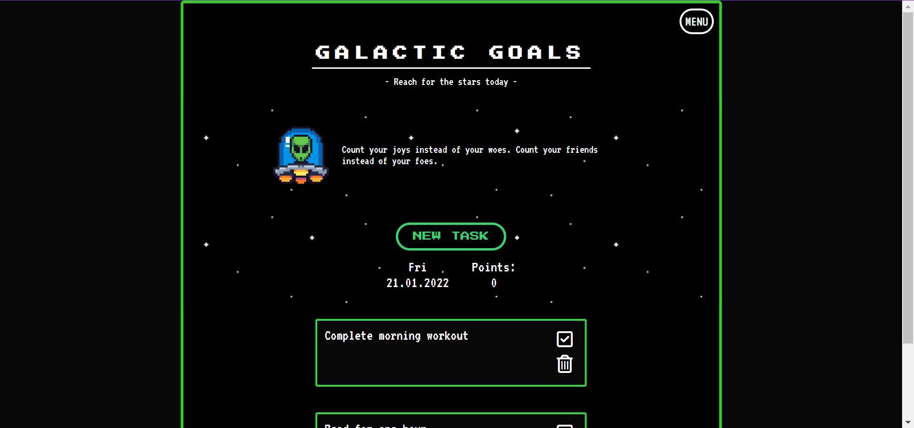
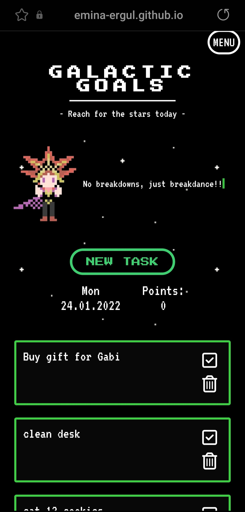

# Galactic Goals
A creative gamified task app with a retro theme, built with vanilla JavaScript.
This was a fun project for me that I got slighty carried away with.

There are a few different characters with different personalities that will keep you motivated as you complete your goals for the day.
Points are collected as you complete goals.
There is also a music player that so far only has 2 tracks to play, both of which I made myself. Sound can also be turned on/off.

I enjoyed coming up with the concept and characters, and may build on this in the future.

Live project here: <a href="https://emina-ergul.github.io/galactic-goals/">Galactic Goals<a>

# Desktop:

# Mobile:

