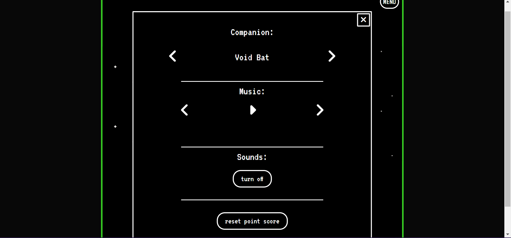

# Galactic Goals
A to do list app with a game like retro theme, built with vanilla JavaScript.
This was more of a creative project for me that I got slighty carried away with.

There are a few different characters with different personalities that will keep you motivated as you complete your goals for the day.
There is also a music player that so far only has 2 tracks to play, both of which I made myself.

I enjoyed coming up with the concept and characters, and may build on this in the future.

Live project here: <a href="https://emina-ergul.github.io/galactic-goals/">Galactic Goals<a>

# Desktop:

# Mobile:

